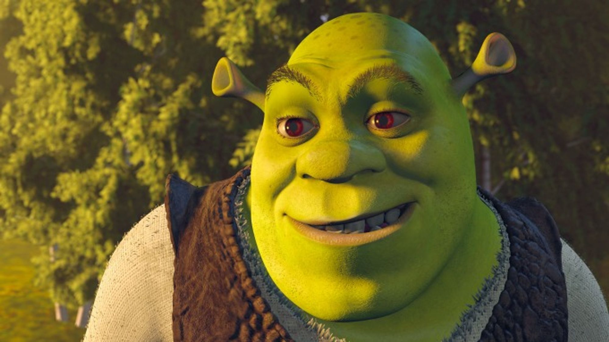

# images_remix

Based on: https://github.com/unishift/stable-diffusion-remix and https://github.com/Huage001/Transfer-Any-Style/blob/main/transfer_any_style.py

Usage:

- pip install -r requirements.txt

- Download AdaAttN checkpoints from https://drive.google.com/file/d/1Lnl_1vWfCvF7ZzmWwkHZG4SexjaXuUc5/view?usp=sharing and place them in ckpt/

- Run the following command: ./run.sh target.jpg style.jpg

# Examples

  
   
  

  
   
  

